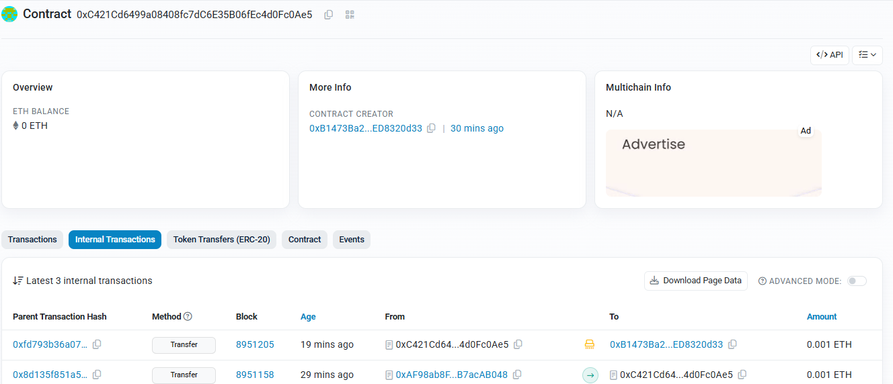

# Description

A contract creator has built a very simple token factory contract. Anyone can create new tokens with ease. After deploying the first token contract, the creator sent 0.001 ether to obtain more tokens. They have since lost the contract address.

This level will be completed if you can recover (or remove) the 0.001 ether from the lost contract address.

```sol
// SPDX-License-Identifier: MIT
pragma solidity ^0.8.0;

contract Recovery {
    //generate tokens
    function generateToken(string memory _name, uint256 _initialSupply) public {
        new SimpleToken(_name, msg.sender, _initialSupply);
    }
}

contract SimpleToken {
    string public name;
    mapping(address => uint256) public balances;

    // constructor
    constructor(string memory _name, address _creator, uint256 _initialSupply) {
        name = _name;
        balances[_creator] = _initialSupply;
    }

    // collect ether in return for tokens
    receive() external payable {
        balances[msg.sender] = msg.value * 10;
    }

    // allow transfers of tokens
    function transfer(address _to, uint256 _amount) public {
        require(balances[msg.sender] >= _amount);
        balances[msg.sender] = balances[msg.sender] - _amount;
        balances[_to] = _amount;
    }

    // clean up after ourselves
    function destroy(address payable _to) public {
        selfdestruct(_to);
    }
}
```

# Solution

1. We know the `Recovery` contract address - `0x30034c1cC6821C0eBd4fFeE5e420aa4cc9FcfdC3`.

2. We can view this contract internal transactions from Etherscan:

The topest `contract creation` transaction links to the `SimpleToken` contract:


3. By clicking that link, we can get back missing address which is `0xC421Cd6499a08408fc7dC6E35B06fEc4d0Fc0Ae5`:



4. Then we can withdraw the balances by calling `destroy` function:

```
cast send 0xC421Cd6499a08408fc7dC6E35B06fEc4d0Fc0Ae5 "destroy(address)" 0xB1473Ba227C4645501E0e05f4839b00ED8320d33 --rpc-url $BASE_SEPOLIA_RPC 
```

# Note

Contract addresses are deterministic and are calculated by keccak256(address, nonce) where the address is the address of the contract (or ethereum address that created the transaction) and nonce is the number of contracts the spawning contract has created (or the transaction nonce, for regular transactions).

Because of this, one can send ether to a pre-determined address (which has no private key) and later create a contract at that address which recovers the ether. This is a non-intuitive and somewhat secretive way to (dangerously) store ether without holding a private key.
