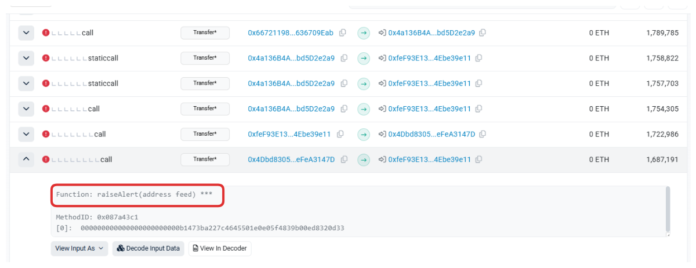

# Description

This level features a CryptoVault with special functionality, the sweepToken function. This is a common function used to retrieve tokens stuck in a contract. The CryptoVault operates with an underlying token that can't be swept, as it is an important core logic component of the CryptoVault. Any other tokens can be swept.

The underlying token is an instance of the DET token implemented in the DoubleEntryPoint contract definition and the CryptoVault holds 100 units of it. Additionally the CryptoVault also holds 100 of LegacyToken LGT.

In this level you should figure out where the bug is in CryptoVault and protect it from being drained out of tokens.

The contract features a Forta contract where any user can register its own detection bot contract. Forta is a decentralized, community-based monitoring network to detect threats and anomalies on DeFi, NFT, governance, bridges and other Web3 systems as quickly as possible. Your job is to implement a detection bot and register it in the Forta contract. The bot's implementation will need to raise correct alerts to prevent potential attacks or bug exploits.

Things that might help:

- How does a double entry point work for a token contract?

```sol
// SPDX-License-Identifier: MIT
pragma solidity ^0.8.0;

import "openzeppelin-contracts-08/access/Ownable.sol";
import "openzeppelin-contracts-08/token/ERC20/ERC20.sol";

interface DelegateERC20 {
    function delegateTransfer(address to, uint256 value, address origSender) external returns (bool);
}

interface IDetectionBot {
    function handleTransaction(address user, bytes calldata msgData) external;
}

interface IForta {
    function setDetectionBot(address detectionBotAddress) external;
    function notify(address user, bytes calldata msgData) external;
    function raiseAlert(address user) external;
}

contract Forta is IForta {
    mapping(address => IDetectionBot) public usersDetectionBots;
    mapping(address => uint256) public botRaisedAlerts;

    function setDetectionBot(address detectionBotAddress) external override {
        usersDetectionBots[msg.sender] = IDetectionBot(detectionBotAddress);
    }

    function notify(address user, bytes calldata msgData) external override {
        if (address(usersDetectionBots[user]) == address(0)) return;
        try usersDetectionBots[user].handleTransaction(user, msgData) {
            return;
        } catch {}
    }

    function raiseAlert(address user) external override {
        if (address(usersDetectionBots[user]) != msg.sender) return;
        botRaisedAlerts[msg.sender] += 1;
    }
}

contract CryptoVault {
    address public sweptTokensRecipient;
    IERC20 public underlying;

    constructor(address recipient) {
        sweptTokensRecipient = recipient;
    }

    function setUnderlying(address latestToken) public {
        require(address(underlying) == address(0), "Already set");
        underlying = IERC20(latestToken);
    }

    /*
    ...
    */

    function sweepToken(IERC20 token) public {
        require(token != underlying, "Can't transfer underlying token");
        token.transfer(sweptTokensRecipient, token.balanceOf(address(this)));
    }
}

contract LegacyToken is ERC20("LegacyToken", "LGT"), Ownable {
    DelegateERC20 public delegate;

    function mint(address to, uint256 amount) public onlyOwner {
        _mint(to, amount);
    }

    function delegateToNewContract(DelegateERC20 newContract) public onlyOwner {
        delegate = newContract;
    }

    function transfer(address to, uint256 value) public override returns (bool) {
        if (address(delegate) == address(0)) {
            return super.transfer(to, value);
        } else {
            return delegate.delegateTransfer(to, value, msg.sender);
        }
    }
}

contract DoubleEntryPoint is ERC20("DoubleEntryPointToken", "DET"), DelegateERC20, Ownable {
    address public cryptoVault;
    address public player;
    address public delegatedFrom;
    Forta public forta;

    constructor(address legacyToken, address vaultAddress, address fortaAddress, address playerAddress) {
        delegatedFrom = legacyToken;
        forta = Forta(fortaAddress);
        player = playerAddress;
        cryptoVault = vaultAddress;
        _mint(cryptoVault, 100 ether);
    }

    modifier onlyDelegateFrom() {
        require(msg.sender == delegatedFrom, "Not legacy contract");
        _;
    }

    modifier fortaNotify() {
        address detectionBot = address(forta.usersDetectionBots(player));

        // Cache old number of bot alerts
        uint256 previousValue = forta.botRaisedAlerts(detectionBot);

        // Notify Forta
        forta.notify(player, msg.data);

        // Continue execution
        _;

        // Check if alarms have been raised
        if (forta.botRaisedAlerts(detectionBot) > previousValue) revert("Alert has been triggered, reverting");
    }

    function delegateTransfer(address to, uint256 value, address origSender)
        public
        override
        onlyDelegateFrom
        fortaNotify
        returns (bool)
    {
        _transfer(origSender, to, value);
        return true;
    }
}
```

# Attack Entry Point

> Attacker can drain the tokens from Vault

The `sweepToken` function of `CryptoVault` contract is the entry point by passing LegacyToken contract address as argument.

```sol
function sweepToken(IERC20 token) public {
    require(token != underlying, "Can't transfer underlying token");
    token.transfer(sweptTokensRecipient, token.balanceOf(address(this)));
}
```

It will invoke the call `token.transfer()` which transfer the tokens from vault to the player.


```bash
tim@tim-virtual-machine ~> cast call 0x547521E4587ee3d8af03128193C91b684a437C9c "cryptoVault()(address)" --rpc-url $BASE_SEPOLIA_RPC
0xe7b0E0f95700A35Eb653c1Ae64390776898e569E
tim@tim-virtual-machine ~> cast call 0xe7b0E0f95700A35Eb653c1Ae64390776898e569E "underlying()(address)" --rpc-url $BASE_SEPOLIA_RPC // underlying = DoubleEntryPoint address
0x547521E4587ee3d8af03128193C91b684a437C9c
tim@tim-virtual-machine ~> cast call 0xe7b0E0f95700A35Eb653c1Ae64390776898e569E "sweptTokensRecipient()(address)" --rpc-url $BASE_SEPOLIA_RPC
0xB1473Ba227C4645501E0e05f4839b00ED8320d33 // player address
```


The `transfer` function of LegacyToken contract will call `delegate.delegateTransfer` functon where `to` is player and `msg.sender` is **Vault**

```sol
function transfer(address to, uint256 value) public override returns (bool) {
    if (address(delegate) == address(0)) {
        return super.transfer(to, value);
    } else {
        return delegate.delegateTransfer(to, value, msg.sender);
    }
}
```

because the `delegate` address is non-0 and is DoubleEntryPoint contract adddress.

```bash
tim@tim-virtual-machine ~> cast call 0x9a8be339052324Bf29089531F8ba0a96c429d2a9 "delegate()(address)" --rpc-url $BASE_SEPOLIA_RPC
0x547521E4587ee3d8af03128193C91b684a437C9c // DoubleEntryPoint contract address
```

The pre-execution check of `onlyDelegateFrom` modifier of `delegateTransfer` will be passed because the `msg.sender` is legacyToken contract address.

# Prevention

Raise Alert when the `origSender == vault`:

```sol
// SPDX-License-Identifier: UNLICENSED
pragma solidity ^0.8.13;

interface IForta {
    function setDetectionBot(address detectionBotAddress) external;
    function notify(address user, bytes calldata msgData) external;
    function raiseAlert(address user) external;
}

interface ICryptoVault {
    function underlying() external returns (address);
}

contract OnChainBot {
    address forta;
    address vault;
    address owner;
    
    constructor() {
        owner = msg.sender;
    }

    function setUp(address _forta, address _vault) external {
        forta = _forta;
        vault = _vault;
    }


    // expect msgData is msg.data of delegateTransfer function
    function handleTransaction(address user, bytes calldata msgData) external {
        require(user == owner);

        bytes4 expectSelector = bytes4(keccak256("delegateTransfer(address,uint256,address)"));

        require(expectSelector == bytes4(msgData[:4]), "Invalid msgData");

        (address to, uint256 val, address origSender) = abi.decode(msgData[4:], (address, uint256, address));

        if (origSender == vault) {
            IForta(forta).raiseAlert(owner);
        }
    }

}
```

Deploy the bot:

```
tim@tim-virtual-machine ~/g/t/contracts (main)> forge create src/OnChainBot.sol:OnChainBot --rpc-url=$BASE_SEPOLIA_RPC --account deployer --broadcast
Deployer: 0xB1473Ba227C4645501E0e05f4839b00ED8320d33
Deployed to: 0x4Dbd8305CB7d2004b433Ae0540f67a9eFeA3147D
Transaction hash: 0xece6554091a8ac88687fe21033fc46b0ef90dda599583a08f5ebf51505f325cc
```

Set the forta and vault address for the bot:

```
tim@tim-virtual-machine ~/g/t/contracts (main)> cast send 0x4Dbd8305CB7d2004b433Ae0540f67a9eFeA3147D "setUp(address,address)" 0xfeF93E1383aff65132656a564c6bf0F4Ebe39e11 0
x5eaeDFc3677628e1761cfF085233ba458ae1e612 --rpc-url $BASE_SEPOLIA_RPC --private-key
```

Register the bot to forta:

```
tim@tim-virtual-machine ~/g/t/contracts (main)> cast send 0xfeF93E1383aff65132656a564c6bf0F4Ebe39e11 "setDetectionBot(address)" 0x4Dbd8305CB7d2004b433Ae0540f67a9eFeA3147D
 --rpc-url $BASE_SEPOLIA_RPC --private-key
```

check if alert is raised:



https://sepolia.etherscan.io/tx/0xd58cb02252646bd33ca8caabe5f4d79a375c2b7bb7d29b999c8fbaebcb3b30a6/advanced#internal
